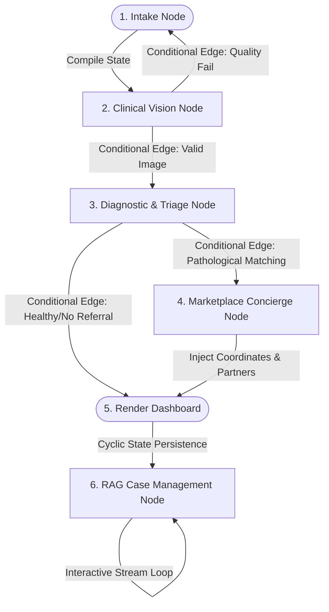

# DantShaant — Product Requirements Document

**Version:** 1.4

**Product:** DantShaant Autonomous Dental AI Assistant & Marketplace

**Document type:** PRD (Product Requirements Document)

**Audience:** Engineering, product, stakeholders, customer demos

---

## 1. Executive Summary

DantShaant is an autonomous AI dental assistant and marketplace platform tailored for Pakistan and UAE markets. Users register on a web platform and interact through an advanced oral scan experience powered by **Google Gemini Flash** alongside **OpenRouter (Auto/Free routing)** to handle agentic inference execution and bypass provider rate limits.

The application has shifted from a stateless tool to a fully persistent, multi-agent ecosystem completely orchestrated and managed utilizing **LangGraph**. Using cyclic graph architecture, state memory, and conditional edge routing, the system coordinates automated tooth scanning, a dedicated "Insist Mode" clinical triage protocol, geospatial marketplace mappings with custom Google Maps components, and continuous, data-driven client case tracking via RAG.

---

## 2. Problem Statement

| Problem | Impact |
| --- | --- |
| Dental issues go undiagnosed until severe

 | Cost, pain, preventable damage

 |
| Existing apps stop at a single result without action loops

 | No follow-through, fragmentation, zero continuity of care

 |
| Generic health chatbots lack dental vision capabilities

 | Poor accuracy on teeth photos

 |
| Dentist monetization and client acquisition are broken

 | High marketing costs for clinics; patients struggle to find targeted specialists matching their exact structural dental condition

 |

---

## 3. Product Vision

**One-line:** Scan your smile, understand your oral health, and get seamlessly connected with the perfect local dentist.

**Core principles:**

1. **Stateful Graph Orchestration:** The multi-agent workflow is modeled explicitly as a state machine using LangGraph. Transitions between scanning, diagnostic feedback, and localized dentist matching are strictly managed via a centralized graph state object to prevent message loss.


2. **Agent-Led Action Loops:** The system does not just provide a static diagnostic report. The AI Dentist Agent actively drives the user toward clinical resolution through intelligent localized referrals.


3. **Two-Sided Marketplace Value:** Provides patients with highly tailored, localized choices while generating a commission-backed revenue pipeline from registered dental clinics.


4. **Data Continuity via RAG:** A **local FAISS** knowledge base (dental documents) plus **MongoDB** conversation and analysis history power context-aware AI chat today; future phases will link per-patient scan findings into the same retrieval layer.


---

## 4. Target Users

| Persona | Need |
| --- | --- |
| **Patient (B2C)** | Rapid teeth screening, personalized local dentist discovery, context-aware AI dental consultation chat, and targeted oral product recommendations.

 |
| **Partner Dentists (B2B)** | Target platform to market clinical operations, acquire high-intent local leads, and manage incoming patient referral bookings.

 |
| **Database/System Engineers** | Scalable relational schemas to support complex multi-tenant profiles, location spatial matching, and agent logging constraints.

 |

---

## 5. Scope

### 5.1 In scope (Updated Phase v1 Foundation)

* Next.js web application with authenticated Patient Dashboard and B2B Dentist Registration interfaces.


* **Three Input Scan Modes:** Snapshot, Live video, and File upload.


* **LangGraph Core Management Array:** State definition, supervisor routing, and edge mechanics coordinating the backend lifecycle.


* **Core Inference Core:** Shared execution between Gemini Flash (vision analysis) and OpenRouter Auto/Free tier (conversational agent logic).


* **AI Dentist Agent Routing Engine:** Coordinates geographical radius searches, condition matches, and dentist selection algorithms.


* **Custom Google Maps Integration:** Embedded pinpoint component displaying targeted local clinics inside the user's immediate radius.


* **Two-Stream Dentist Source Layer:** Dynamic indexing split between Premium Registered Partners (commission-based reservation system) and fallback Random Best Dentists scraping metrics.


* **Relational DBMS Layer:** Full PostgreSQL storage tracking client profiles, active dentist listings, and transactional bookings.


* **RAG-Driven Chatbot (implemented):** Local **FAISS** vector store over ingested dental knowledge, hybrid semantic + keyword retrieval, OpenRouter-backed chat at `/v1/chat/*`, and Next.js UI at `/chat`. MongoDB persists users, conversations, messages, and analysis history.


### 5.2 Out of scope (Deferred to later release windows)

* Native Cross-Platform Mobile Applications (React Native).


* WhatsApp Automation/Outbound Twilio dialing workflows.


* Decentralized self-hosted vision arrays (LoRA/QLoRA).


* Automated direct split-payment processing gateways (e.g., Stripe, JazzCash).


---

## 6. Agentic Orchestration & Workflows

DantShaant uses a multi-agent architecture built on top of the OpenRouter Auto/Free framework. The lifecycle execution flow, node processing structures, conditional edge checks, and persistent state fields are managed through **LangGraph**.

### 6.1 LangGraph State Architecture

The shared graph memory context (`DentalGraphState`) acts as the single source of truth across the runtime workspace:

```python
from typing import TypedDict, List, Dict, Any

class DentalGraphState(TypedDict):
    user_id: str
    image_bytes: bytes
    visual_findings: List[Dict[str, Any]]
    diagnosis_report: Dict[str, Any]
    user_coordinates: Dict[str, float]
    recommended_dentists: List[Dict[str, Any]]
    active_chat_history: List[Dict[str, str]]
    next_routing_node: str

```

### 6.2 LangGraph Operational Workflow



### 6.3 Specialized Node Agents & Task Definitions

#### 1. Clinical Vision Agent

* **Management Layer:** Managed as Node `clinical_vision_agent` in LangGraph.


* **Underlying Model:** Google Gemini Flash.


* **Workflow & Responsibilities:**
* Triggered dynamically when the graph state accepts a new image buffer payload.


* Pre-processes images using OpenCV filters to catch brightness or composition blur patterns.


* Returns classified diagnostic tags mapping out localized oral indicators (plaque, cavities, or gingivitis markers).


* Writes updates into the shared state database keys before relinquishing node priority.


#### 2. Diagnostic & Triage Agent

* **Management Layer:** Managed as Node `diagnostic_triage_agent` in LangGraph.


* **Underlying Model:** OpenRouter Auto/Free Routing Engine (Deterministic Fallback Execution).


* **Workflow & Responsibilities:**
* Consumes the current state metrics and ensures pathological features take computational priority over healthy rows.


* Formulates clinical text emphasizing medical disclaimers and consumer health notices.


* Controls "Insist Mode," updating routing configuration flags inside the graph frame to enforce immediate downstream dentist lookups for higher-tier severity outputs.


#### 3. Marketplace Concierge Agent (The Matchmaker)

* **Management Layer:** Managed as Node `marketplace_concierge_agent` in LangGraph.


* **Underlying Model:** OpenRouter Auto/Free Routing Engine + Spatial DBMS Tools.


* **Workflow & Responsibilities:**
* Evaluates spatial distances using the user's coordinates directly against PostgreSQL database listings.


* Sorts results using strict application tiers, filtering through verified Premium Partners before deploying fallback listings of highly rated clinics.


* Packages location pins into custom mapping objects to render interactive Google Maps elements on the patient's screen.


* Records appointment confirmation parameters and maps platform commissions.


#### 4. RAG Case Management Agent

* **Management Layer (today):** FastAPI `conversation_engine` + `chat_service` — **not yet** a LangGraph node; planned migration to the cyclic `ChatNode` in Section 6.2.


* **Underlying Model:** OpenRouter Auto/Free (conversational text) + **local FAISS** (dental knowledge retrieval) + **sentence-transformers** (`all-MiniLM-L6-v2`, on-device embeddings).


* **Implemented workflow:**
* On each user message, `retrieval_service` runs **hybrid search**: FAISS cosine similarity (normalized `IndexFlatIP`) blended with keyword overlap; optional boost when the chunk matches the conversation’s `active_dental_issue`.


* Retrieved chunks are **summarized** (not dumped raw) and injected into the LLM prompt via `get_enhanced_prompt()`.


* Conversations, messages, and scan analysis records are stored in **MongoDB** (`orchestrator/database.py`); the vector index holds **curated dental knowledge documents**, not per-user scan embeddings yet.


* **Planned workflow (LangGraph + PostgreSQL):** Index patient-specific scan findings and tie retrieval to `DentalGraphState` for longitudinal, scan-aware chat and product recommendations.


---

## 7. User Stories

### Patient Experience

| ID | As a… | I want to… | So that… |
| --- | --- | --- | --- |
| US-01 | Patient | Register and log into my personal account | My diagnostic history, medical scans, and profile settings are permanently saved.

 |
| US-02 | Patient | Perform an automated visual scan of my teeth

 | I instantly see localized condition reports with transparent severity rankings.

 |
| US-03 | Patient | View nearby dentist recommendations on a custom Google Map | I can visually pinpoint qualified professionals closest to my immediate radius.

 |
| US-04 | Patient | Book a consultation directly with a recommended dentist | I can secure an appointment while passing my dental scan records securely to the clinic.

 |
| US-05 | Patient | Converse with an AI chatbot regarding my old records | I get real-time answers regarding my specific history without re-uploading images.

 |

### Dentist B2B Experience

| ID | As a… | I want to… | So that… |
| --- | --- | --- | --- |
| US-06 | Dentist | Register my dental clinic profile, specialty tags, and location coordinates | The AI agent can automatically match high-intent patients to my business based on my specific expertise.

 |
| US-07 | Dentist | Pay a structured percentage-based commission per successful booking | I trade a small fee for guaranteed local client acquisitions without paying upfront marketing retainers.

 |

---

## 8. Functional Requirements

### 8.1 Web Client & User Dashboards (Next.js)

* **FR-W01:** Provide authenticated interfaces for two distinct user roles: Patients and Dentists.


* **FR-W02:** Embed a custom Google Maps component displaying a user pinpoint alongside targeted dentist pins within a reactive radius.


* **FR-W03:** Render an AI Consultation Chat window (`apps/web/app/chat`, `ChatInterface.tsx`) that calls orchestrator `/v1/chat/*` endpoints; responses are grounded by the local FAISS RAG layer before OpenRouter generation.


* **FR-W04:** Display interactive Product Recommendation carousels bound dynamically to the patient's current diagnostic severity tags.


### 8.2 AI Dentist Agent & Orchestrator

* **FR-O01:** Run primary multimodal evaluations on uploaded images using the Gemini Flash API.


* **FR-O02:** Fall back to the OpenRouter Auto/Free tier endpoint for text orchestration, conversational dialogue, and high-frequency queries to eliminate rate constraints.


* **FR-O03:** Initialize LangGraph orchestration instances to manage state updates across multiple worker agents, utilizing checkpoint systems to support historical state rollbacks.


* **FR-O04:** Execute the Recommendation Agent Engine using two prioritized database lookup pathways:
1. **Tier 1 (Premium Partners):** Registered dental businesses within a given radius matched to the patient's specific dental conditions.


2. **Tier 2 (Fallback Discoverability):** Curated random highly rated dental clinics within the user's radius if premium options are exhausted.


* **FR-O05:** Calculate automated percentage-based commissions on any successful appointment creation event and log the financial transactions securely to the database.


### 8.3 Database & Context Storage (DBMS Layer)

* **FR-D01:** Maintain multi-tenant relationship structures mapping Patients, Scans, Diagnostic Outputs, Registered Dentists, Appointments, and Commission Statements.


* **FR-D02:** Support geospatial queries (PostGIS or coordinate bounding boxes) to calculate real-time distance matrix weights for the mapping service.


* **FR-D03 (implemented — interim):** MongoDB collections for users, conversations, messages, and `analysis_history`; RAG retrieval reads dental knowledge from `data/rag/` FAISS index. **Planned:** PostgreSQL views linking per-patient scan findings into the RAG index for personalized recall.


---

## 9. Condition Schema & Monetization Map

| Detected Condition | Target Specialist Match | Action Trigger | Marketplace Routing Rule |
| --- | --- | --- | --- |
| Healthy

 | General Practitioner (Checkup) | Maintenance Reminder

 | Suggest nearby Premium Dentist for routine scaling

 |
| Plaque / Tartar

 | Dental Hygienist | Product Suggestion & Brushing Guide

 | Showcase local Premium clinics with cleaning deals

 |
| Early/Advanced Cavity

 | Endodontist / Restorative | Schedule Appointment within 1 to 2 Weeks

 | Filter Map by Endodontists; route to Premium first, else Random Best

 |
| Gingivitis / Gum Disease

 | Periodontist | Immediate Dentist Referral

 | High-urgency warning; flag closest verified Periodontist on Map

 |

---

## 10. Environment Configuration (Updated)

| Variable | Service | Purpose |
| --- | --- | --- |
| `OPENROUTER_API_KEY` | Orchestrator | Access key for OpenRouter Auto/Free routing endpoints

 |
| `OPENROUTER_MODEL` | Orchestrator | Chat model (e.g. `openrouter/free`)

 |
| `TEETH_ANALYZER_GEMINI_API_KEY` | Analyzer | Primary Google AI Studio key for vision-based scans

 |
| `MONGODB_URI` | Orchestrator | MongoDB connection for users, chat, analysis history (implemented)

 |
| `MONGODB_DB` | Orchestrator | Database name (default `dantshaant`)

 |
| `DATABASE_URL` | All Backends | PostgreSQL connection string (planned; marketplace & bookings)

 |
| `GOOGLE_MAPS_API_KEY` | Web Frontend | Powering custom geo-radius components and pinpoint UI elements

 |
| `PLATFORM_COMMISSION_PERCENTAGE` | Orchestrator | Value defining the transaction cut per successful appointment

 |

---

## 11. Local FAISS RAG System (Implemented)

The teammate-delivered RAG stack is **fully local**: no hosted vector DB. Documents are chunked, embedded on-device, indexed in FAISS, and queried at chat time.

### 11.1 Architecture

```mermaid
flowchart LR
    subgraph ingest [Ingestion — offline]
        Docs[data/dental_knowledge/*.md txt pdf docx] --> Chunker[text_chunker 500/100 overlap]
        Chunker --> Emb[embedding_service all-MiniLM-L6-v2]
        Emb --> FAISS[(FAISS IndexFlatIP)]
        FAISS --> Disk[data/rag/faiss_index.faiss + .metadata]
    end
    subgraph runtime [Runtime — orchestrator :8000]
        Chat[/v1/chat/message] --> CE[conversation_engine]
        CE --> RS[retrieval_service hybrid search]
        RS --> Emb2[embedding_service]
        RS --> FAISS2[(vector_store.load)]
        RS --> Prompt[get_enhanced_prompt summarized context]
        Prompt --> OR[OpenRouter LLM]
        CE --> Mongo[(MongoDB conversations)]
    end
    Disk --> FAISS2
```

### 11.2 Package layout

| Component | Path | Role |
| --- | --- | --- |
| Embeddings | `orchestrator/src/orchestrator/rag/embeddings.py` | Lazy-loaded `SentenceTransformer` (`all-MiniLM-L6-v2`, 384-dim); graceful degrade if model unavailable |
| Vector store | `orchestrator/src/orchestrator/rag/vector_store.py` | FAISS `IndexFlatIP` with L2-normalized vectors (cosine similarity); persist to `data/rag/faiss_index.{faiss,metadata}` |
| Chunker | `orchestrator/src/orchestrator/rag/chunker.py` | 500-char chunks, 100-char overlap; metadata: `source_file`, `chunk_index` |
| Ingestion | `orchestrator/src/orchestrator/rag/ingest.py` | Batch ingest `.txt`, `.md`, `.pdf`, `.docx` from a directory |
| Retrieval | `orchestrator/src/orchestrator/rag/retrieval_service.py` | Hybrid semantic + keyword scoring; `top_k=2`, similarity threshold `0.5`; `active_dental_issue` boost from conversation state |
| HTTP API | `orchestrator/src/orchestrator/rag_endpoints.py` | Prefix `/rag` |
| Chat wiring | `orchestrator/src/orchestrator/conversation_engine.py` | Calls `retrieval_service.get_enhanced_prompt()` before LLM |
| Startup | `orchestrator/src/orchestrator/main.py` | Lifespan loads `vector_store.load()` on boot |
| Frontend | `apps/web/app/chat/page.tsx`, `ChatInterface.tsx` | Patient chat UI |

### 11.3 RAG HTTP API

| Method | Endpoint | Description |
| --- | --- | --- |
| `POST` | `/rag/ingest` | Ingest files from `data/dental_knowledge` (or request body path) |
| `POST` | `/rag/query` | Debug retrieval: returns ranked chunks for a query string |
| `GET` | `/rag/stats` | Chunk count, sources, `top_k`, threshold |
| `GET` | `/rag/health` | Vector store loaded, embedding smoke test |
| `DELETE` | `/rag/clear` | Wipe FAISS index and metadata files |

OpenAPI docs: `http://127.0.0.1:8000/docs#/RAG`

### 11.4 Operations

```powershell
.\scripts\ingest-dental-knowledge.ps1   # ingest data\dental_knowledge → FAISS
.\scripts\start-services.ps1            # orchestrator loads index on startup
```

Supported knowledge formats: `.md`, `.txt`, `.pdf` (and `.docx` when `python-docx` is installed).

### 11.5 Retrieval behavior (implemented defaults)

* **Semantic:** Query (and optional `active_dental_issue`) embedded locally → FAISS top-*k* search.
* **Keyword fallback:** Word-overlap score when embeddings fail.
* **Hybrid score:** `0.7 × semantic + 0.3 × keyword`, plus `+0.15` if chunk text contains `active_dental_issue`.
* **Prompt injection:** Up to two deduplicated key sentences prefixed as `Relevant context: …` in the LLM prompt.

### 11.6 Implemented vs planned

| Capability | Status |
| --- | --- |
| Local FAISS index over dental knowledge docs | **Done** |
| Ingest script + `/rag/*` admin API | **Done** |
| Hybrid retrieval + conversation-state issue boost | **Done** |
| Chat UI + MongoDB session persistence | **Done** |
| Per-patient scan embeddings in vector store | Planned |
| LangGraph `ChatNode` wrapping RAG loop | Planned |
| PostgreSQL-backed personalized RAG recall | Planned |

---

*DantShaant PRD v1.4*