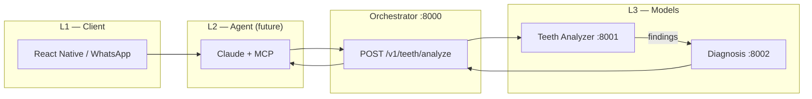

# DantShaant — Teeth Analyzer & Diagnosis Model Plan

Spec-driven split: **contracts live in `specs/`**; implementations must not break OpenAPI without a version bump.

## Why two services?

| Service | Port | Responsibility | Swappable in |
|---------|------|----------------|--------------|
| **Teeth Analyzer** | 8001 | Vision inference: image → `VisualFinding[]` | Phase 2 (LoRA/QLoRA) |
| **Diagnosis** | 8002 | Clinical mapping: findings → `ConditionLabel`, severity, actions | Phase 2+ (rules → ML optional) |
| **Orchestrator** | 8000 | HTTP composition for `analyze_teeth_image` MCP tool | Agent/MCP layer |

This matches the technical doc’s **L3 Inference** vs **agent severity routing** (Tables 8 & 12) and enables Phase 1 MVP (stub/Claude Vision behind analyzer) without changing diagnosis or orchestrator contracts.

---

## Teeth Analyzer — Vision model

### Target (Phase 2, doc §04)

- **Base:** LLaVA-1.6 (Mistral 7B) — primary; Qwen2-VL fallback for Urdu-heavy captions
- **Method:** LoRA train → QLoRA 4-bit NF4 deploy (~4GB, T4 / RunPod)
- **Accuracy target:** ≥ 87% condition recognition (end-to-end with diagnosis)

### LoRA config (from doc Table 7)

| Parameter | Value |
|-----------|--------|
| Rank (r) | 16 |
| Alpha (α) | 32 |
| Target modules | q_proj, v_proj, k_proj, o_proj |
| LR | 2e-4, cosine + 100-step warmup |
| Epochs | 3–5, early stopping |

### Datasets (Table 5)

1. UFBA Dental X-ray (~4k)
2. Tufts Dental (~1k)
3. Kaggle dental photos (~8k)
4. Synthetic augmentation (~5k)
5. DantShaant user photos (Phase 2+, dentist-verified)

### Analyzer output contract

- **Input:** `AnalyzeRequest` — `user_id`, `image_base64`, optional `locale`
- **Output:** `AnalyzeResponse` — raw labels (`plaque_detected`, `cavity_suspect`, …), `overall_quality_score`, `model_id`
- **Not in scope:** severity, disclaimers, dentist actions (Diagnosis service)

### Implementation phases

| Phase | Backend | `model_id` |
|-------|---------|------------|
| **Now** | Stub in `teeth_analyzer/inference.py` | `stub-v0` |
| **MVP** | Claude Vision adapter (same API) | `claude-vision-v0` |
| **Phase 2** | `LLaVA + PEFT` loader in `inference.py` | `llava-lora-v1` |
| **Edge** | Merged QLoRA on T4 | `llava-qlora-v1` |

### File layout (future training)

```
training/
  teeth_analyzer/
    datasets/          # manifests, not raw blobs in git
    train_lora.py
    quantize_qlora.py
    eval/
services/teeth_analyzer/src/teeth_analyzer/
  inference.py         # load model, run forward
  model_loader.py      # Phase 2
```

---

## Diagnosis — Clinical classifier

### Target behavior (doc Table 8)

Maps analyzer findings to:

| Condition | Severity | Confidence threshold | Action trigger |
|-----------|----------|----------------------|----------------|
| Healthy | None | > 0.85 | maintenance_reminder |
| Plaque / Tartar | Mild | > 0.80 | product + brushing alarm |
| Early Cavity | Moderate | > 0.78 | product + dentist (2 weeks) |
| Advanced Cavity | High | > 0.75 | urgent dentist (< 1 week) |
| Gingivitis | Moderate | > 0.78 | antibacterial + dentist |
| Severe Gum Disease | Critical | > 0.72 | immediate referral |
| Discoloration | Cosmetic | > 0.82 | whitening product |
| Unknown | — | below threshold | request clearer photo |

### Current implementation

- Rule-based: `diagnosis/classifier.py` — `LABEL_MAP`, `CONDITION_THRESHOLDS`, `CONDITION_META`
- Low photo quality → `Unknown` + `request_clearer_photo` without acting on weak vision confidence (risk mitigation Table 18)

### Future options (same `DiagnoseResponse` spec)

1. **Weighted ensemble** over top-k findings (no new service)
2. **Small tabular/ML model** trained on (findings, history) → condition logits
3. **LLM assist** only for explanation text — labels still from rules/thresholds for safety

### Agent routing (doc Table 12)

Diagnosis `action_trigger` feeds the **Agent Core** (Claude + MCP) — not implemented in orchestrator yet. Next foundation items:

- `POST /v1/teeth/analyze` ✅ (pipeline)
- MCP `analyze_teeth_image` → call orchestrator
- PostgreSQL log of `analysis_id` / `diagnosis_id`

---

## Integration diagram



---

## Spec-driven workflow

1. Edit `specs/*.openapi.yaml` first.
2. Update `packages/dantshaant_common/schemas.py` to match.
3. Implement or adjust service handlers.
4. Contract tests: compare live OpenAPI from FastAPI to spec (add in Phase 1 week 2).

---

## Success metrics (from doc Table 1)

| Metric | Owner service |
|--------|----------------|
| Teeth recognition ≥ 87% | Teeth Analyzer (+ diagnosis threshold policy) |
| Response latency < 2.5s | Analyzer QLoRA + orchestrator parallelization later |
| Autonomous follow-up | Agent/MCP (not these services) |

---

## Next engineering tasks

1. Install deps: `uv pip install -r requirements.txt`
2. Run `scripts/start-services.ps1` — verify `GET /health` on all three ports
3. Test pipeline: `POST http://127.0.0.1:8000/v1/teeth/analyze` with sample base64 image
4. Phase 1: optional Claude Vision backend behind Teeth Analyzer
5. Phase 2: training pipeline + swap `model_id` without changing Diagnosis API
